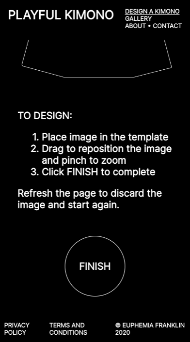

# Playful Kimono

<a href="http://www.playfulkimono.com">Playful Kimono</a> asks the question, what would your kimono look like?

## Contents

* [Background](#background)
* [Technologies](#technologies)
* [Features](#features)
* [Credits](#credits)

## Background

Drawing inspiration from kimono sample books, or hinagata-bon from the Edo and Meiji periods, the project reinterprets the kimono design process through a digital template and invites users to bring their own unique designs to life.

Playful Kimono has been promoted by the Victoria and Albert Museum and is supported by the Kingston University Business School.

Concept and design by <a href="https://www.instagram.com/euphemia.work/?hl=en">Euphemia Franklin</a>.

Development by Alex Franklin.

## Technologies

The Playful Kimono website was built with [React](https://reactjs.org/) and [Redux](https://redux.js.org/). The kimono design editor was built with the [Fabric.js](http://fabricjs.com/) canvas library.

Playful Kimono is hosted on [Heroku](https://www.heroku.com/) and backed by a customised [Strapi](https://strapi.io/) server, [Amazon S3](https://aws.amazon.com/s3/) for image storage, and a [MongoDb Atlas](https://www.mongodb.com/cloud/atlas) database.

This stack allows for complete control of the front-end visual design and image editing implementation, simple content management and moderation for the project's designer, and minimal ongoing hosting costs.

## Features

###Upload, edit, and submit a kimono design:

###'Infinite' gallery loads more designs as you scroll:

###Expanded gallery view:

###Responsive design and touch support:

  

## Credits

Playful Kimono uses icons from the [Iconify Bootstrap Icons collection](https://iconify.design/icon-sets/bi/).

Zoom range slider styles generated with [Daniel Stern's range.css tool](http://danielstern.ca/range.css/).